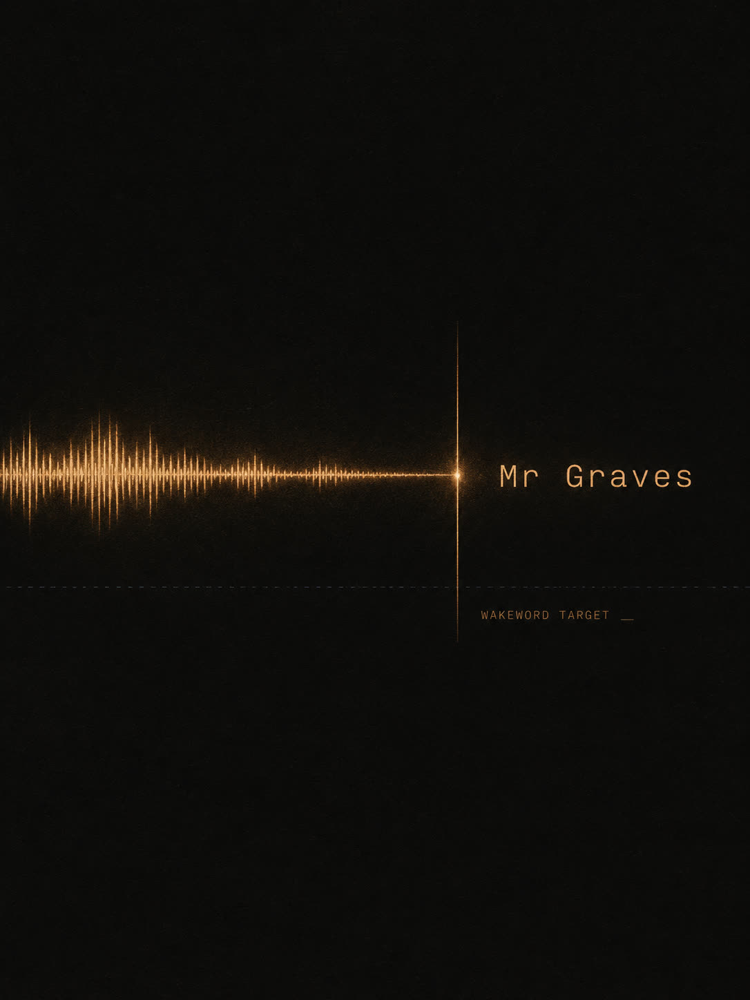

# mr-graves



> Reference Android deployment of an openWakeWord-trained custom wake word, with the production tuning notes and the v1-failure teaching artefact the trainer notebook leaves out. Companion to [`alfiedennen/openwakeword-colab-2026`](https://github.com/alfiedennen/openwakeword-colab-2026). MIT (code) + CC-BY-NC 4.0 (docs/data).

The wake word is *Mr Graves* — the formal address. The household uses *Hey Harold* as the casual address (handled by the [microwakeword-trainer](https://github.com/alfiedennen/microwakeword-trainer) sibling stack on ESP32 speakers); *Mr Graves* is reserved for the on-device Android wake word, which fires less often by design — formal addresses live in a quieter zone of the language.

---

## What this is, what this isn't

- **Is**: end-to-end Android integration (Kotlin foreground service + optional Capacitor plugin), production threshold tuning methodology, the v1 vs v2 saga as a teaching artefact, a reference trained ONNX classifier you can drop in to verify your runtime works
- **Is NOT**: a trainer. For training your own model see [`alfiedennen/openwakeword-colab-2026`](https://github.com/alfiedennen/openwakeword-colab-2026)

The companion site piece — narrative version of the v1 failure and the threshold-tuning lesson, in plainer English — is at [haroldathome.com/mr-graves](https://haroldathome.com/mr-graves).

---

## What you get

- **A 660-line Android foreground service** (`WakewordService.kt`) that runs the openWakeWord 3-stage pipeline (mel → embedding → classifier) against the device microphone, fires a broadcast intent on detection, and survives lockscreen + boot
- **A Capacitor plugin variant** (`WakewordPlugin.kt`, 190 lines) — drop-in if you're embedding into a hybrid app
- **A boot receiver** (`WakewordBootReceiver.kt`) — handles the Android-14-blocks-mic-FGS-from-boot constraint cleanly
- **An AndroidManifest snippet** with all required permissions + component declarations
- **A pre-trained "Mr Graves" classifier** (`models/mr_graves.onnx`, 790 KB) you can drop in immediately to verify the pipeline works end-to-end
- **The failed v1 ONNX** kept as a teaching artefact — load it and watch a wake word fire every 2 seconds on noise
- **Comprehensive docs** — install / tune / postmortem / how-it-works / known-limits

---

## Quickstart

```sh
git clone https://github.com/alfiedennen/mr-graves.git
cd mr-graves

# 1. Read what you're getting
cat README.md

# 2. Inspect the Android service
cat android/WakewordService.kt

# 3. Drop into your Android Studio project
cp android/*.kt /path/to/your/project/android/app/src/main/java/com/example/wakeword/
cp models/mr_graves.onnx /path/to/your/project/android/app/src/main/assets/wakewords/
# Pull melspectrogram.onnx + embedding_model.onnx from `pip install openwakeword`
# (see models/README.md)

# 4. Merge AndroidManifest-snippet.xml into your AndroidManifest.xml

# 5. Build, deploy to a Pixel, say "Mr Graves" — see docs/deploy-android.md
```

Full step-by-step in [`docs/deploy-android.md`](docs/deploy-android.md).

---

## Production tuning

Default threshold is `0.5`. **Raise to `0.85` for production** — see [`docs/tune.md`](docs/tune.md) for the methodology + diagnostic flow.

If you train your own model and it fires every two seconds on the kettle — read [`docs/postmortem-v1.md`](docs/postmortem-v1.md) before tuning the threshold further. The threshold can't rescue a model trained on the wrong objective.

---

## How it works

For the architectural deep-dive — the 3-stage openWakeWord pipeline, the Android-specific design choices (foreground service of type "microphone", NNAPI delegate, full-screen-intent for BAL_BLOCK, pause/resume by mic release, the float-NOT-normalised gotcha) — see [`docs/how-it-works.md`](docs/how-it-works.md).

---

## Known limits

Android-only (no iOS / web), single-classifier-at-a-time, the bundled ONNX is over-fitted to one voice (train your own for production). Full list at [`docs/known-limits.md`](docs/known-limits.md).

---

## Repo layout

```
mr-graves/
├── README.md                     ← this file
├── LICENSE                       MIT (code)
├── LICENSE-CONTENT               CC-BY-NC 4.0 (docs/data/images)
├── REDACTION.md                  transparent record of what was scrubbed
├── CHANGELOG.md
├── android/
│   ├── README.md                 what to copy where
│   ├── WakewordService.kt        ~660-line foreground service
│   ├── WakewordPlugin.kt         ~190-line Capacitor plugin
│   ├── WakewordBootReceiver.kt   boot-time hook
│   └── AndroidManifest-snippet.xml
├── models/
│   ├── README.md                 the 3 models + where the upstream two come from
│   ├── mr_graves.onnx            reference trained classifier (790 KB)
│   └── _archive_v1_failed.onnx   teaching artefact — failed first attempt
├── docs/
│   ├── deploy-android.md         end-to-end recipe
│   ├── tune.md                   production threshold tuning
│   ├── postmortem-v1.md          when v1 fired every two seconds on the kettle
│   ├── how-it-works.md           architectural deep-dive
│   ├── train.md                  link to the trainer + after-training integration
│   └── known-limits.md
└── credits/
    └── haroldathome.md
```

---

## See also

- [**openwakeword-colab-2026**](https://github.com/alfiedennen/openwakeword-colab-2026) — the trainer (Colab notebook). Train your own wake word in 75-90 min.
- [**microwakeword-trainer**](https://github.com/alfiedennen/microwakeword-trainer) — sibling stack for ESP32 wake words (TensorFlow Lite Micro, ~60 KB models). Used by the *Hey Harold* casual-address wake word on Atom Echo speakers in the same household.
- [**openWakeWord upstream**](https://github.com/dscripka/openWakeWord) — the framework this builds on.

---

## Licences

| Scope | Licence |
|---|---|
| Code (`android/`, `.githooks/`) | **MIT** — see [`LICENSE`](LICENSE) |
| Documentation, sample data, prose, screenshots | **CC-BY-NC 4.0** — see [`LICENSE-CONTENT`](LICENSE-CONTENT) |
| ONNX model weights (`models/*.onnx`) | **MIT** (treated as code-equivalent — neural net weights, no PII) |
